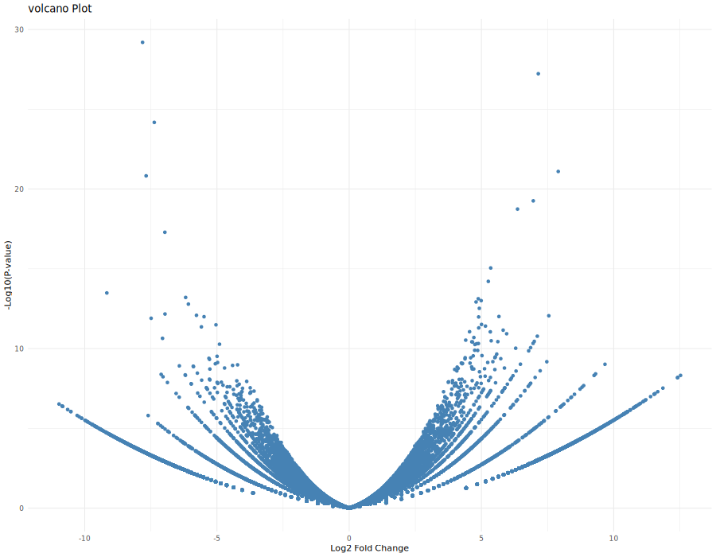
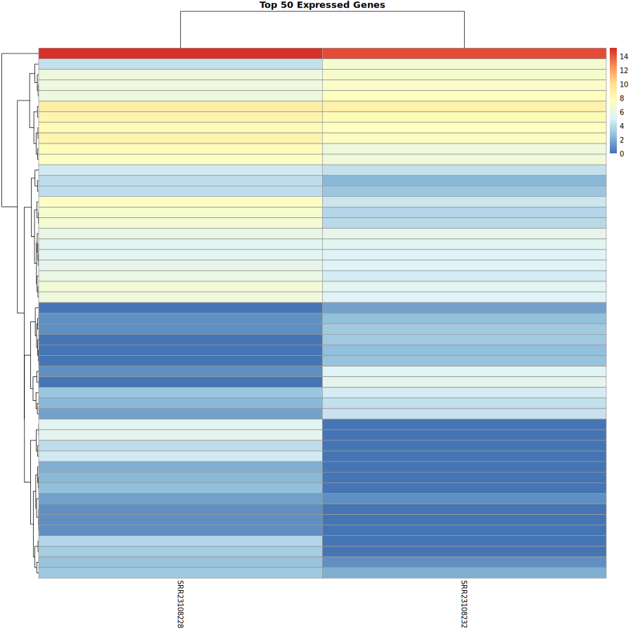

# RNA-seq Differential Gene Expression Analysis

## Overview

This project performs differential gene expression analysis between control and treatment RNA-seq samples.

The complete RNA-seq workflow includes quality assessment, read trimming, genome alignment, read quantification, and statistical identification of differentially expressed genes using DESeq2.

## Dataset

**NCBI SRA Project:** PRJNA925118

Two paired-end RNA-seq samples were analyzed:

| Condition | SRA Accession |
|-----------|---------------|
| Control | SRR23108228 |
| Treatment | SRR23108232 |

The samples were analyzed as single-end reads for downstream processing.

## RNA-seq Analysis Workflow

### 1. Quality Control

**Tool used: FastQC**

Quality assessment was performed on raw sequencing reads before trimming.

Outputs:
- FastQC HTML reports

### 2. Read Trimming

**Tool used: Trimmomatic**

Adapter sequences and low-quality bases were removed to improve read quality.

### 3. Genome Alignment

**Tool used: HISAT2**

Cleaned reads were aligned against the reference genome.

Alignment outputs were processed for downstream gene quantification.

### 4. Read Quantification

**Tool used: featureCounts**

Aligned reads were assigned to genes to generate a gene-level count matrix.

### 5. Differential Expression Analysis

**Tool used: DESeq2 (R/Bioconductor)**

Differential expression analysis was performed between:

- Control group
- Treatment group

Statistical analysis identified significantly upregulated and downregulated genes.

## Results

The analysis generated:

- Gene count matrix
- Differential expression results
- Volcano plot
- Heatmap visualization
- Quality control reports

## Visualization

### Volcano Plot



### Heatmap



## Repository Structure

```
RNA-seq-DESeq2-Analysis/

├── counts/
│   └── gene_counts.txt
│
├── deseq2/
│   ├── DESeq2_results.csv
│   ├── counts_matrix.csv
│   ├── metadata.csv
│   ├── deseq2_analysis.R
│   ├── volcano_plot.R
│   ├── heatmap_plot.R
│   ├── volcanoPlot.png
│   └── Heatmap.png
│
├── qc_raw/
│   └── FastQC reports
│
├── qc_trimmed/
│   └── FastQC reports after trimming
│
└── .gitignore
```
## Tools & Technologies

- FastQC
- Trimmomatic
- HISAT2
- featureCounts
- R
- DESeq2
- ggplot2
- pheatmap

## Key Skills Demonstrated

- Next-generation sequencing (NGS) data analysis
- RNA-seq preprocessing
- Quality control assessment
- Genome alignment
- Gene expression quantification
- Differential expression analysis
- Biological data visualization

## Author

**Fiza Ahmad**  
BS Bioinformatics Student
